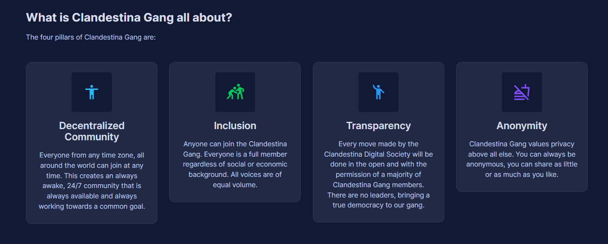

# Welcome to ClandestinaDAO!

## Welcome to the Gang!

A privacy-first digital society on [The Secret Network](https://scrt.network).&#x20;

DAO, Gang, Community, 420 rare.&#x20;

#### What is the ClandestinaGang all about?

## ****:star:**Phase 1 Mission Statement** :star:**** 

Our main goal this year is to build the Clandestina Digital Society into a massive decentralized autonomous organization of privacy advocates, secret agents and all-around great people. Like cryptocurrencies, we want the Clandestina Gang to be decentralized, with not one single person controlling it, but instead dividing ownership and direction-deciding responsibilities among every single member.

_Decentralized Community, Inclusion, Transparency, Anonymity._

These 4 things are the cornerstone of our movement, and we intend to build, together, a society that works towards these common goals.

**The four pillars of Clandestina Gang are:**

*   Decentralized Community:&#x20;

    Everyone from any time zone, all around the world, can join at any time. This creates an always awake, 24/7 community that is always available and always working towards a common goal.
*   Inclusion:&#x20;

    Anyone can join the Clandestina Gang. Everyone is a full member, regardless of social or economic background. All voices are of equal volume.
*   Transparency:

    Every move made by the Clandestina Digital Society will be done in the open and with the permission of a majority of Clandestina Gang members. There are no leaders, bringing a true democracy to our gang.
*   Anonymity:&#x20;

    Clandestina Gang values privacy above all else. You can always be anonymous, you can share as little or as much as you like.

## ****:shushing\_face: **Furthering the SCRT ecosystem** :shushing\_face:  

The reason we are all here is because of the Secret Network. Our lords and saviors Tor and Guy have given us this gift, and we will work hard to promote and protect it. Promoting and growing the user base of SCRT will not only bring more members to Clandestina Gang, but benefit the network and ecosystem as well as crypto as a whole.

Clandestina’s twitter outreach currently includes three operational products: @SCRTshark, @CryptoNewsShark and @ClandestinaBot. @SCRTshark offers hourly price, volume and social statistics for the SCRT network. @CryptoNewsShark offers the latest news from throughout the cryptocurrency space. Our latest addition, @ClandestinaBot tracks sales of ClandestinaGang NFT's, listing the $SCRT sell price and tagging Stashh marketplace - helping to raise awareness of its offerings and status as a premerier . Together these accounts have over 3,600 followers, bringing the gospel of crypto and SCRT to new people every day.&#x20;

### Objectives:

* Increase awareness and understanding of the Secret Network. As proud members of the Secret Network Community, we are united by a common mission: to advance privacy as a public good.

## :satellite: SCRT Full Validator Node with Airdrops :satellite:  

_<mark style="color:yellow;">**\*need to expand on this / provide more details, however these details are still in the process of being decided upon, particularly discussions on DAO drop frequency, delegation incentives, multisig**</mark>_&#x20;

Clandestina will be hosting a full node on the SCRT network. This will be a true community node and run with 2 reasons.

1 — To support, secure and further the SCRT ecosystem.

2 — To provide sweet, sweet airdrops to all of our community stakes and NFT holders.

All SCRT received from running the node, after server expenses and Clandestina Community Fund contributions, will be airdropped to Clandestina NFT holders and node delegates.


[Broken link](broken-reference)


## Genesis and New Team Members

Clandestina reminded that anyone interested in joining the team con offer their services, since everyone is a volunteer as well as Tina Holder, so we are all working for the love of the project.

* Lead DEV and all around good guy: @Kevin
* DAO lead and always around with IBC alpha: @Ertemann-nazrfwehru
* Clandestina Enthusiast # 1, has been with the team since before the mint: @\*Becca
* DEV and creator @clandestina
* Special shoutout to @harmonious\_solutions, who was from the beginning with the team, and brought attention to the project. Everyone is invited to follow his [YouTube channel](https://www.youtube.com/c/wisebeyondbitcoin) as it’s the best covering SCRT and Crypto Space.
* New admin of the Spanish Language channel, as well as English, and $SCRT expert: @natyka1980

We are always looking to expand the team and bring on more people to pump up the gang even more.&#x20;

<mark style="color:yellow;"></mark>
